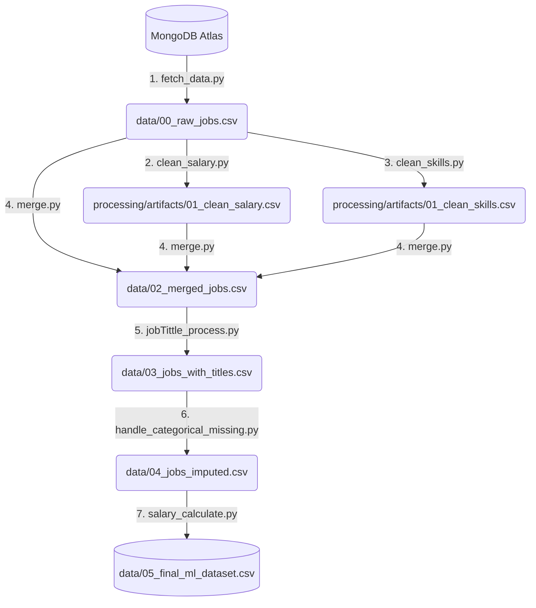

# 🛠 Data Processing Pipeline

Thư mục này chứa toàn bộ các script xử lý dữ liệu (ETL pipeline) cho dự án ADYm. 

## 🌟 Nhìn chung (Overview)

Cho những ai mới bắt đầu xem phần xử lý dữ liệu: Hệ thống hiện tại có 7 script độc lập. Để giúp quá trình chạy dữ liệu và hiểu luồng đi dễ dàng hơn, **tất cả các bước xử lý đã được tự động hóa vào một script trung tâm là `run_pipeline.py`.**

### Luồng Dữ Liệu (The Flow Diagram):


## 🚀 Cách chạy Pipeline (Run instructions)

Bạn có thể chạy toàn bộ tiến trình chỉ với 1 lệnh từ **thư mục gốc của dự án**:

1. **Chạy Toàn Bộ (Mất thời gian do phải kéo từ MongoDB):**
   ```bash
   python processing/run_pipeline.py
   ```
   *Note: Bước này sẽ lấy dữ liệu trực tiếp từ Database về để chạy qua các khâu phía dưới.*

2. **Chạy Bỏ Qua Bước Kéo Dữ Liệu (Nhanh hơn):**
   ```bash
   python processing/run_pipeline.py --skip-fetch
   ```
   *Lựa chọn này cực kỳ hữu ích nếu bạn đã có sẵn file `data/raw_jobs.csv` và chỉ muốn chạy lại quá trình Cleaners / Merge / Calculate.*

## 📂 Expected Output

- **Dữ liệu Hoàn Chỉnh cuối cùng cho ML** sẽ nằm tại: `data/05_final_ml_dataset.csv`.
- Mục review các Chức danh/Nhóm công việc rác/chưa phân loại sẽ trả về tại: `data/03_unclassified_titles_report.csv`.
